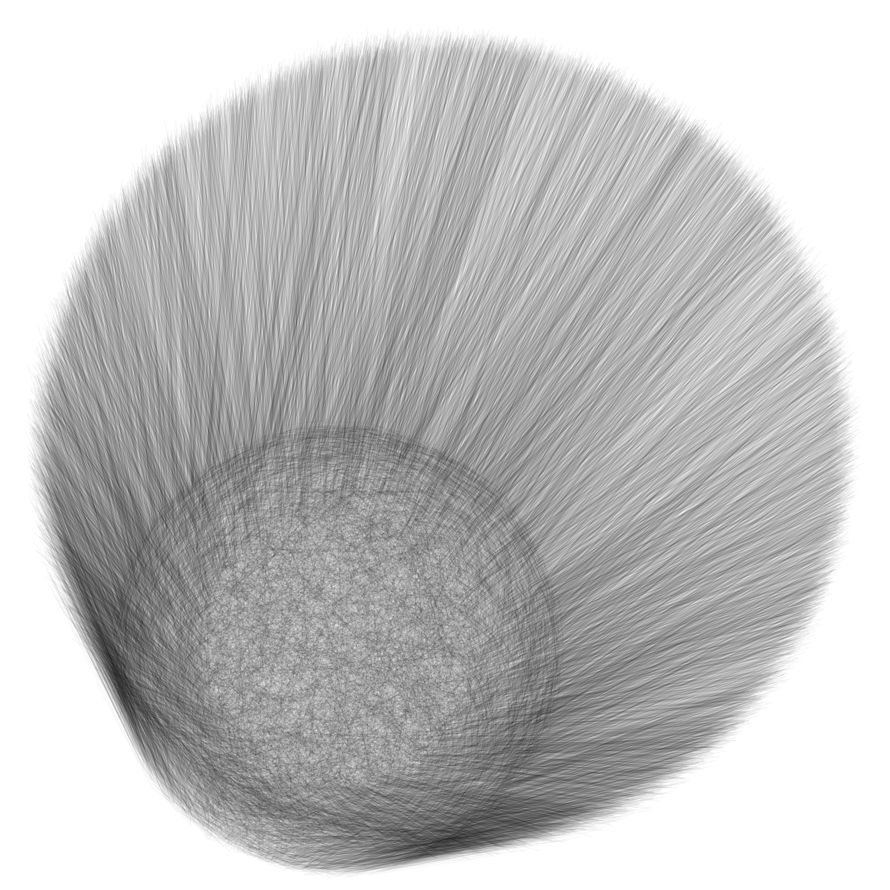
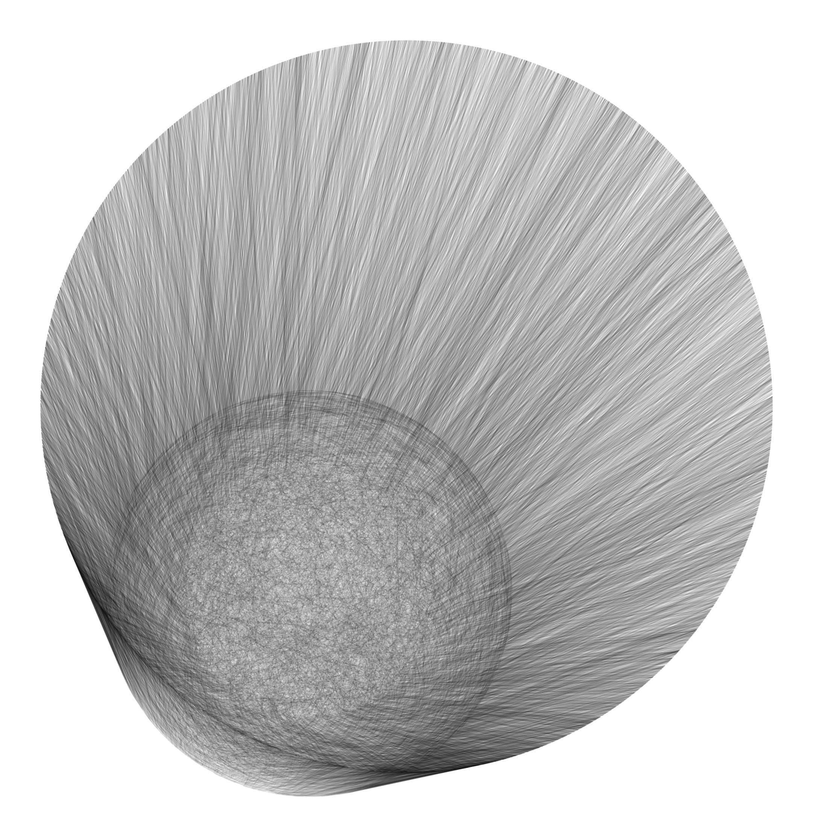
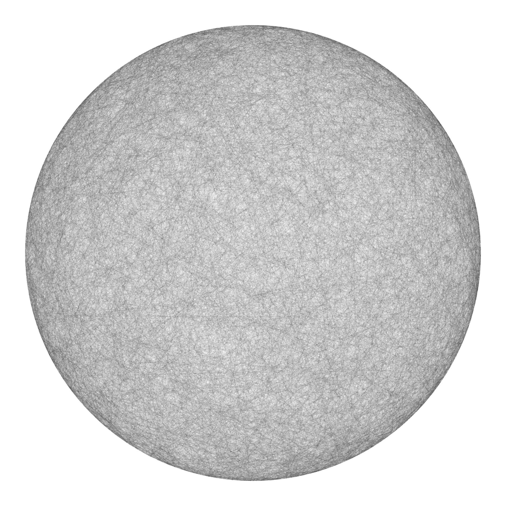

# Genuary 001

https://genuary.art/

JAN.1 (credit: Michael Lowe)

Draw 10,000 of something.

[John Green drawing 170,000 circles](https://www.youtube.com/watch?v=ILMEVnVD8m8)

My prompts:

- Circle
- Line -> Chords
- Arc

-----
## Output
#### Fuzzy/Furry edition

#### Crisp edges edition

#### Moon edition
