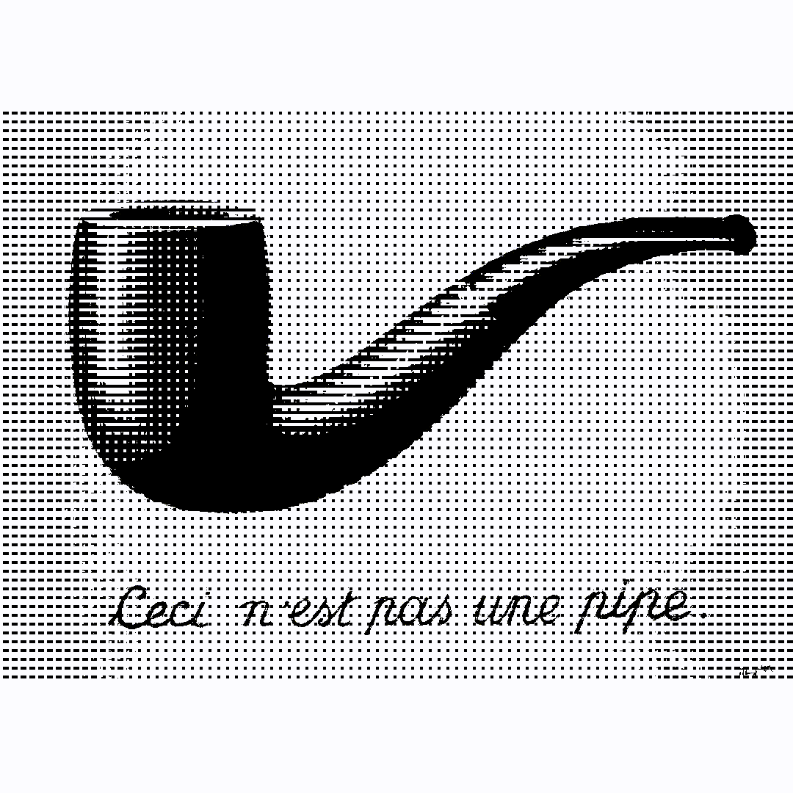
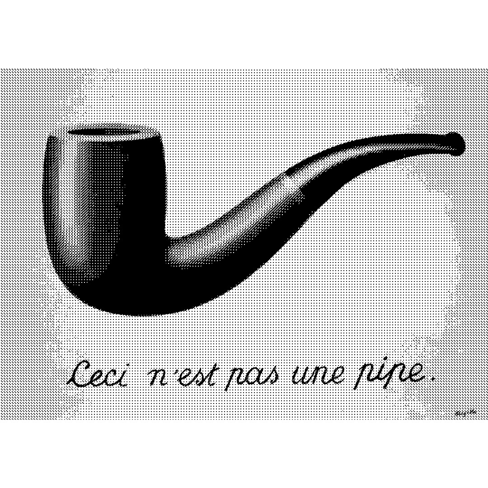
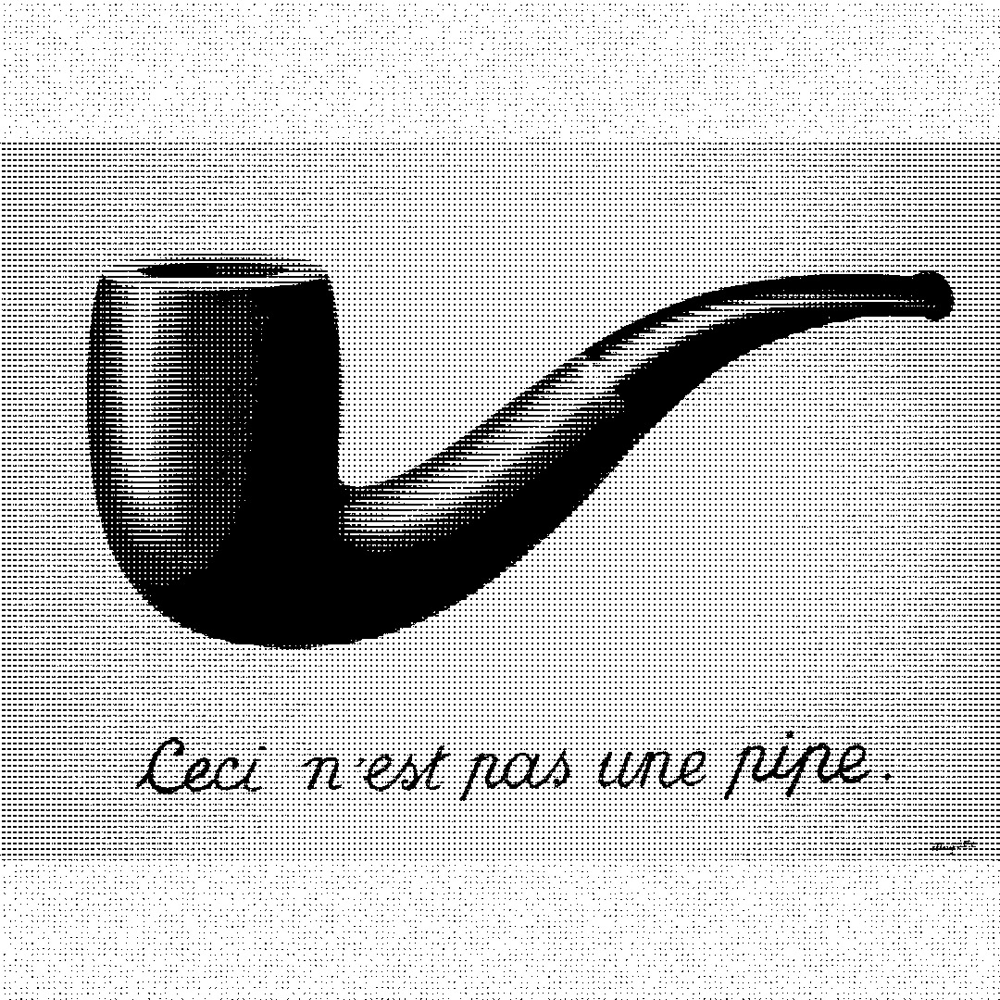

# Genuary 002

https://genuary.art/

JAN.2 (credit: Anna Lucia)
Dithering.

- [Code Golf: Dither a Grayscale Image](https://codegolf.stackexchange.com/questions/26554/dither-a-grayscale-image)
- [The article I wish I had about monochrome image dithering](https://surma.dev/things/ditherpunk/)
- [Joel Yliluoma’s arbitrary-palette positional dithering algorithm](https://bisqwit.iki.fi/story/howto/dither/jy/)
- [Free blue noise textures](http://momentsingraphics.de/BlueNoise.html)
- [DHALF.TXT](http://web.archive.org/web/20190316064436/http://www.efg2.com/Lab/Library/ImageProcessing/DHALF.TXT)

My prompts:

- high quality
- black and white
- chunky

-----
## Output

#### Animation of the collective outputs

-----

#### 00
Sequential dither, scaled 4x, no noise

-----

#### 01
Bayer 4x4 dither, scaled 4x, noise added

-----

#### 02
Disperesed dither, scaled 2x, no noise

-----

#### 03
Sequential, scaled 2x, noise added

-----
#### 04
Bayer 4x4 dither, scaled 1x, noise added
