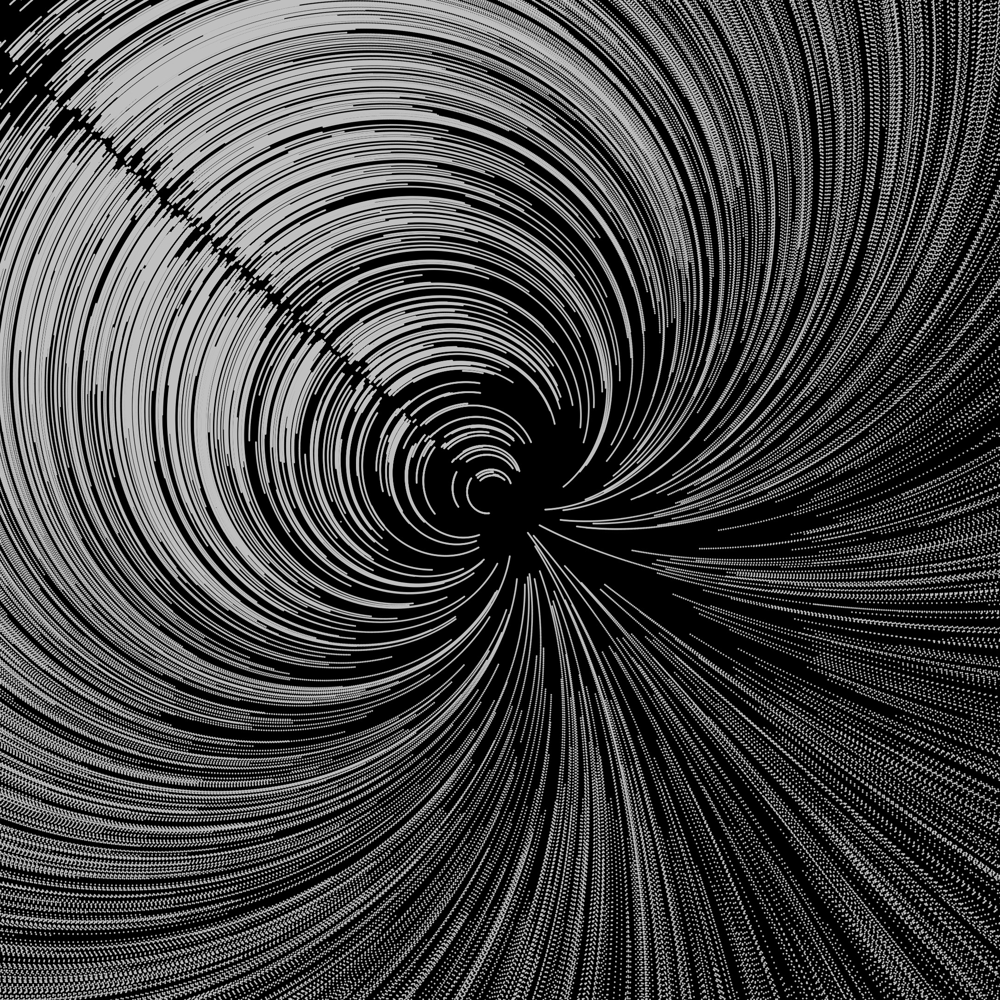
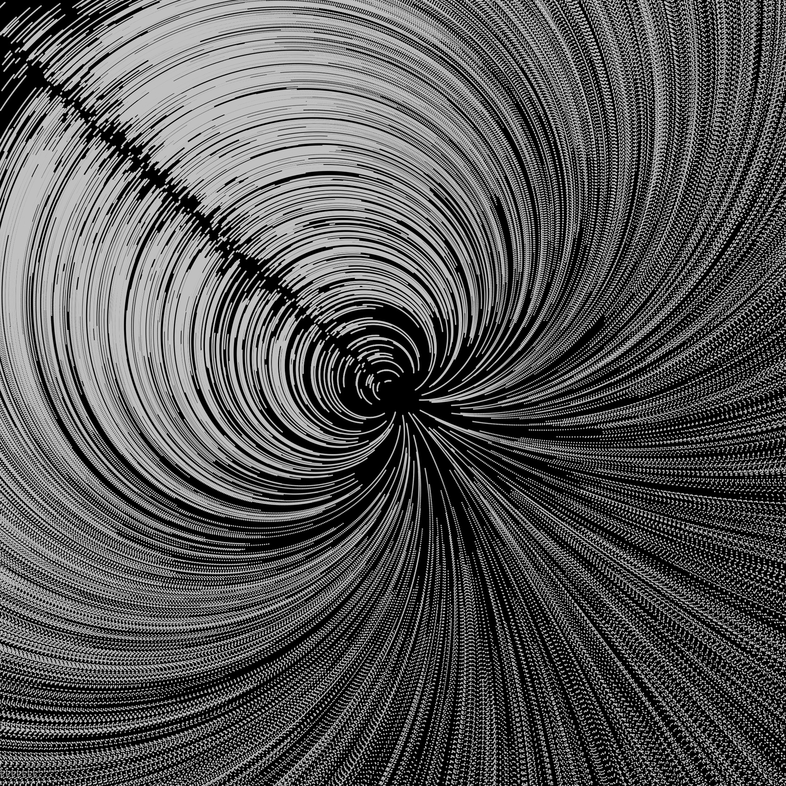
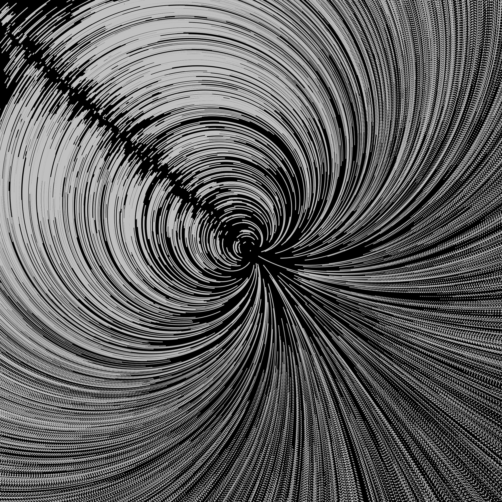
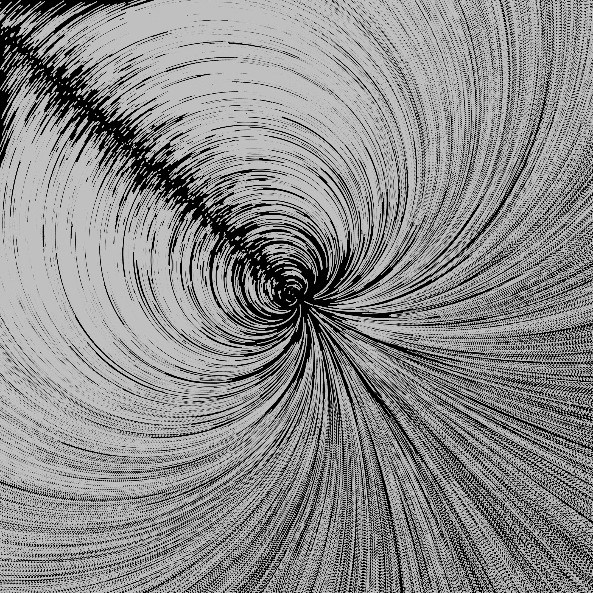

# Genuary 003

https://genuary.art/

JAN.3 (credit: Lionel Radisson)
Space.

My prompts

- Nebula
- Motion
- color?
- demoscene

what is space?

- space between things
- outer space
- extra terrestrial
- ufos
- stars
- galaxies
- quarks
- big bang
- black holes
- neutron stars
- spaceships
- planets
- dark matter
- cold
- dark
- empty
- light
- constellations

-----

## Output

This one did not go as expected -- and I'm happy about that!

I started with the idea of a demoscene starfield kind of animation and made an error early on that I really liked the initial effect of. So I rolled with it and shaped out this effect as something i quite enjoy and that I think reflects the prompt of "space".

-----

