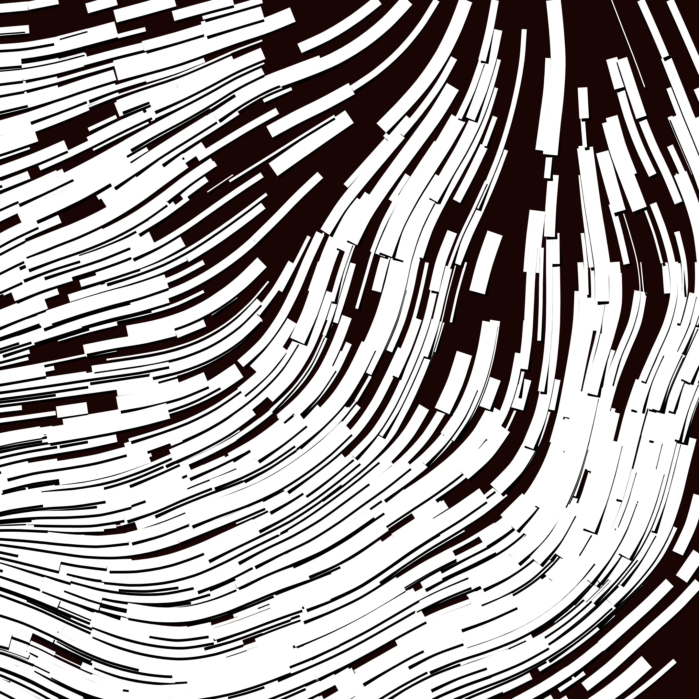

# Genuary 004

JAN.4 (credit: Alexis André) The next next Fidenza.

[Tyler Hobbs’ Fidenza](https://tylerxhobbs.com/fidenza)

I had a bunch of fun figuring out some of the basics of what went into Fidenza. I'm a loooooong way from creating something this like (no collision detection, no spacing, colour palettes could use a lot of work) but it was enjoyable none-the-less.

There's a good chance I'll come back to play with this some more.

-----

#### Black and white




-----

#### Animaux


-----


-----


-----


-----

Reminder:

```zsh
ffmpeg -r 12 -f image2 -s 1080x1080 -pattern_type glob -i '*.jpg' -vcodec libx264 -crf 25  -pix_fmt yuv420p test.mp4
```