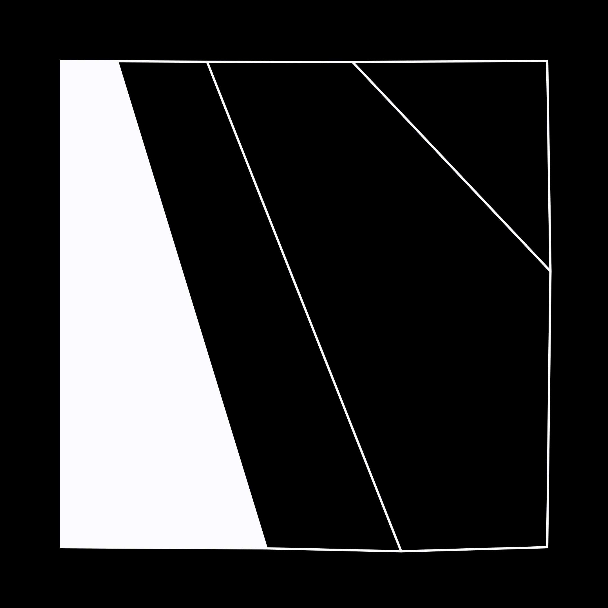
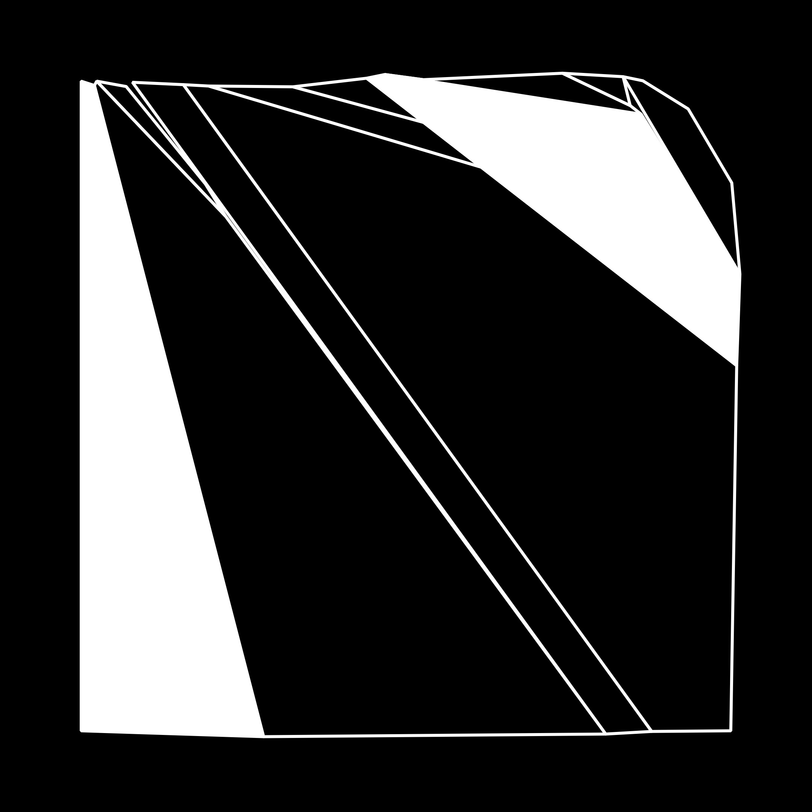
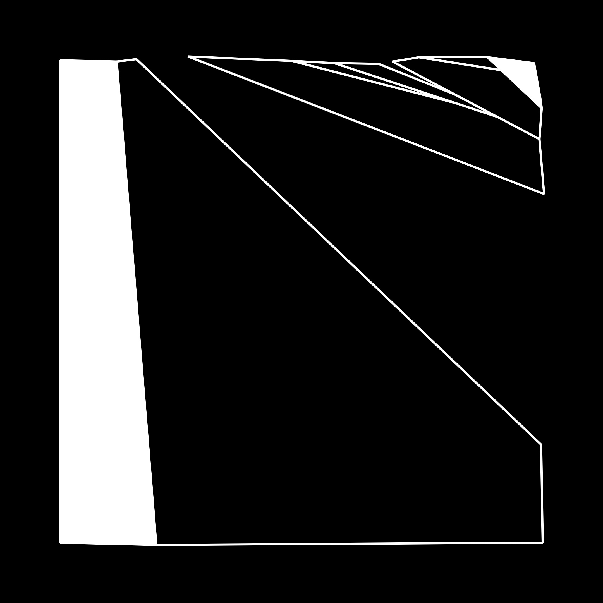
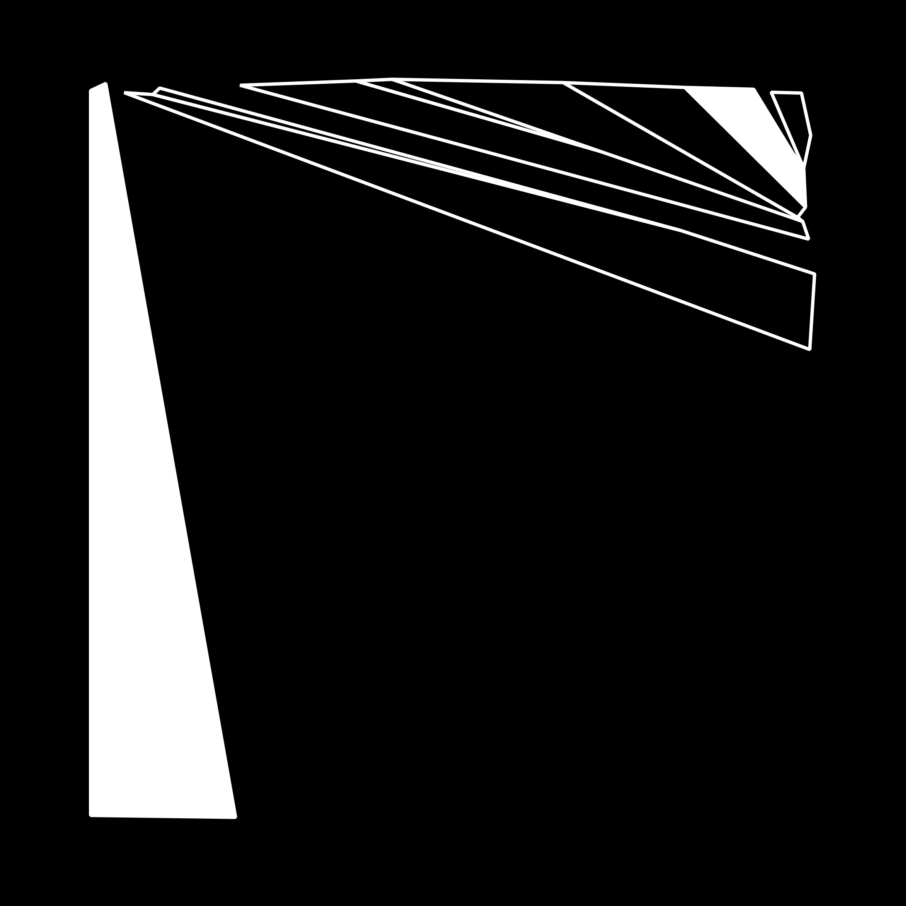
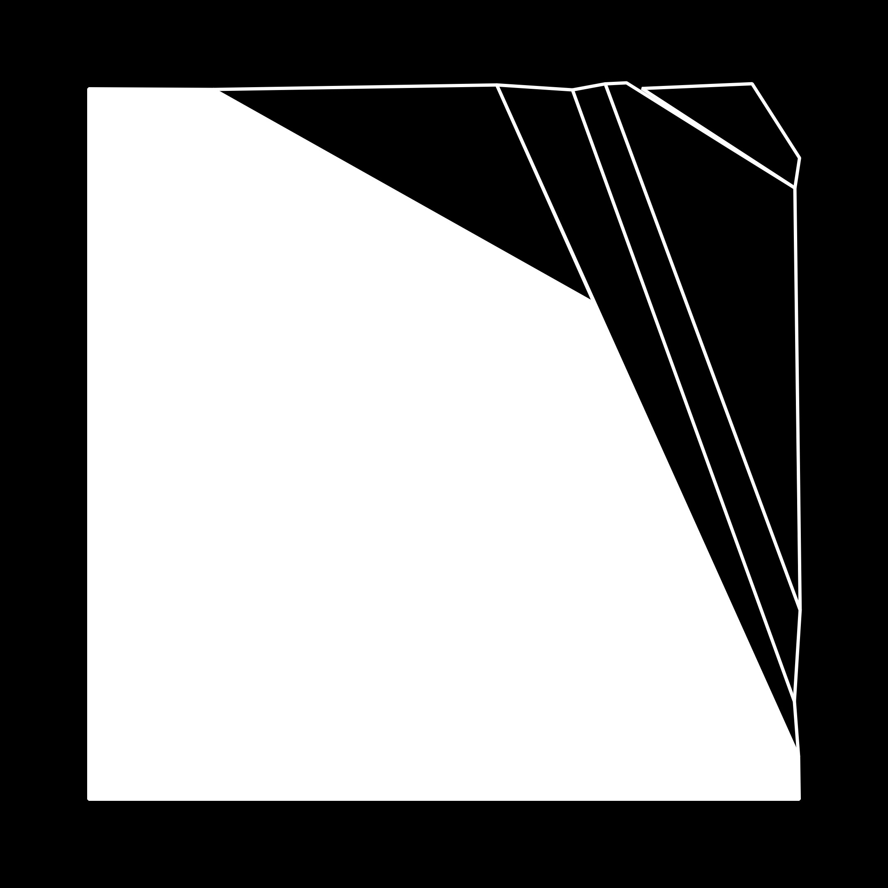

# Genuary 2022

JAN.5 (credit: Thomas Lin Pedersen) Destroy a square.

My prompts:

- area subdivision
- ~~Voronoi~~
- ~~line subdivision and distribution~~

-----

#### Animated collection of outputs

#### A small subset the outputs

