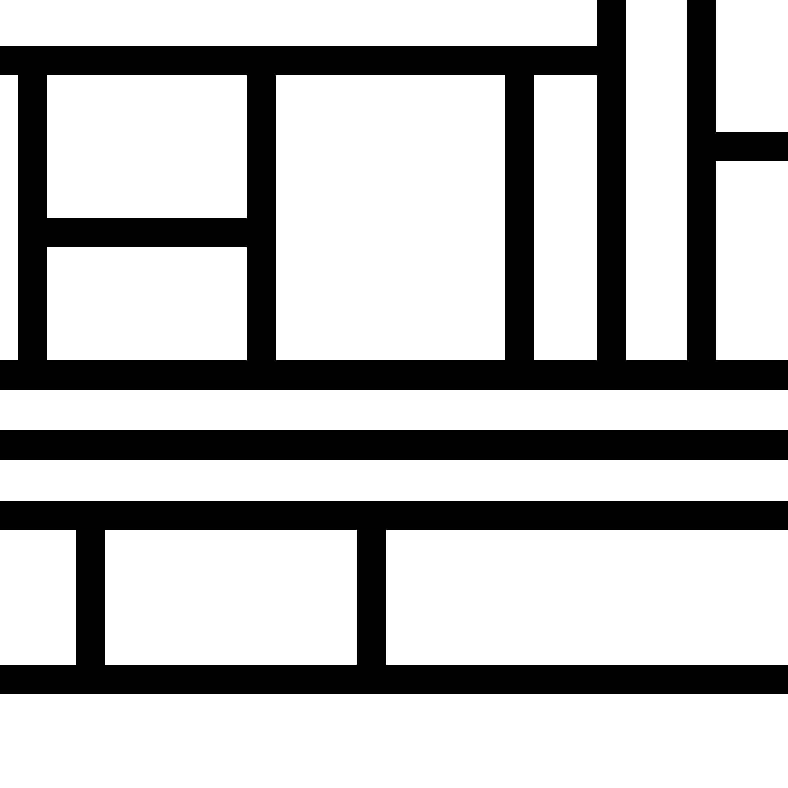

# Genuary 007

Sol LeWitt Wall Drawing.

My Prompts:

Wall Drawing #614:

Rectangles formed by 3-inch (8 cm) wide India ink bands, meeting at right angles.

([source](https://massmoca.org/event/walldrawing614/))

-----

Draw a line segment from top to bottom at a random horizontal position.

Begin:

Select a point at random.

Choose, in an alternating fashion, to draw a horizontal or vertical segment.

Based on the orientation, find the two nearest segments (including the edges) and join them with a new line segment.

Repeat.

-----

#### Animated collection of outputs

#### A subset the outputs

