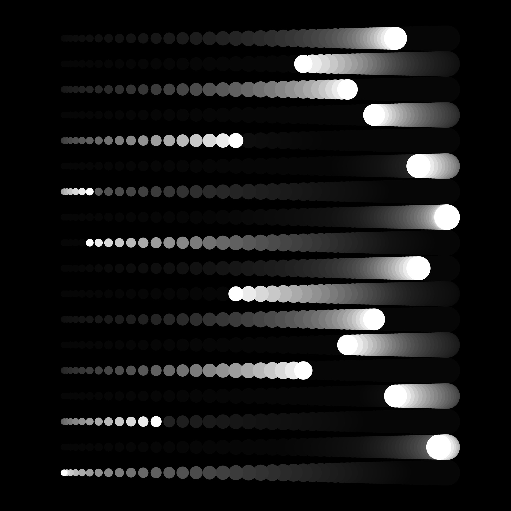

# Genuary 2022

JAN.8 (credit: Bruce Holmer): Single curve only.

My prompts:

- bezier curve -> •• cubic-bezier( 0, .95 , .92, .69 ) ••
- animation
- timing curve
- ~~blocks~~
- black and white

-----

### Animated output

-----
### A subset the outputs
#### 02

#### 03

#### 04

