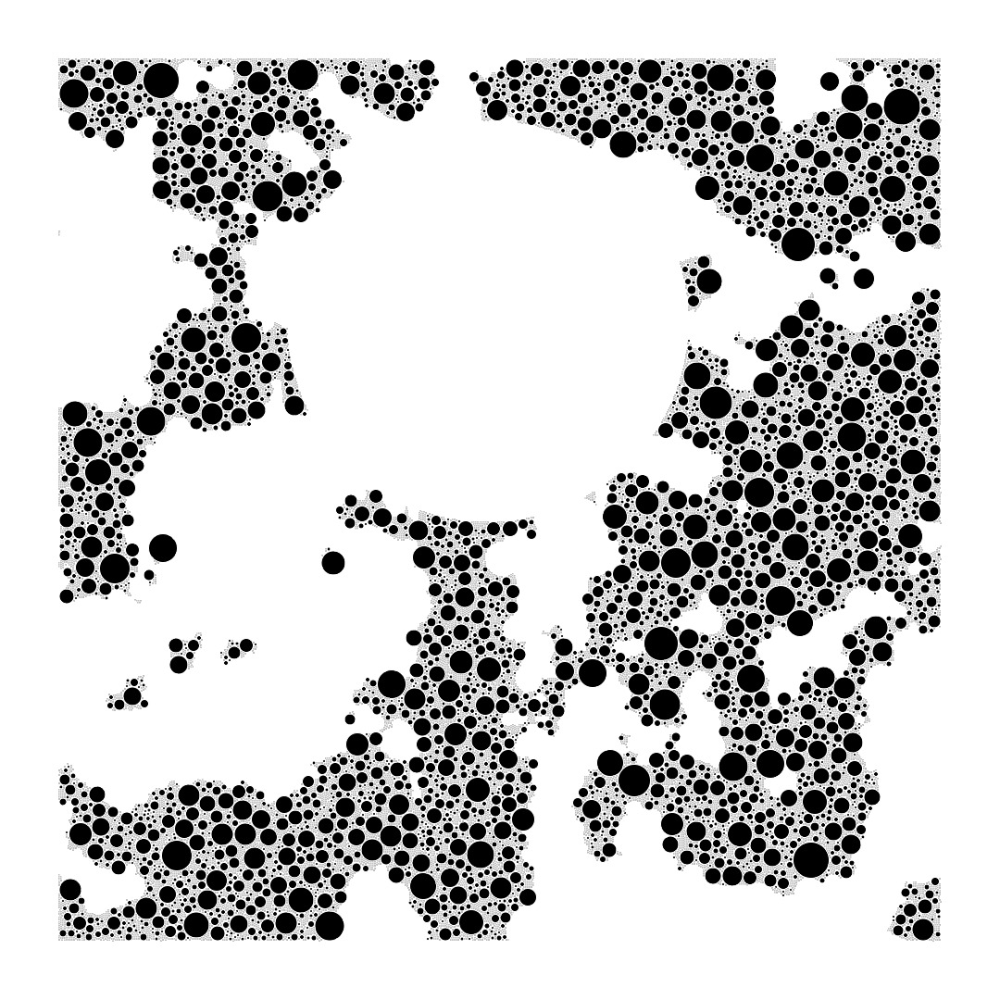
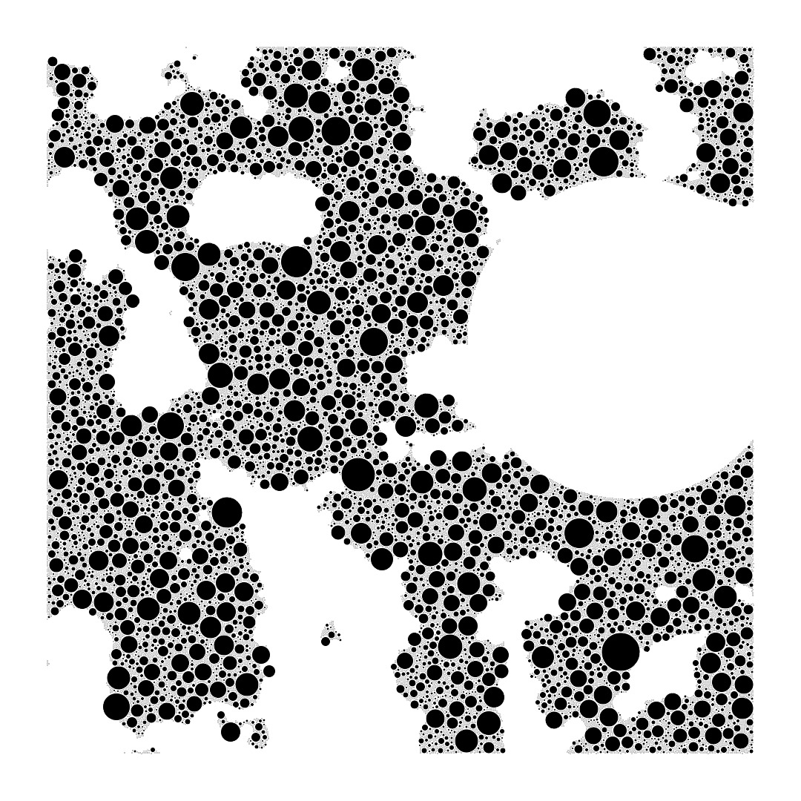
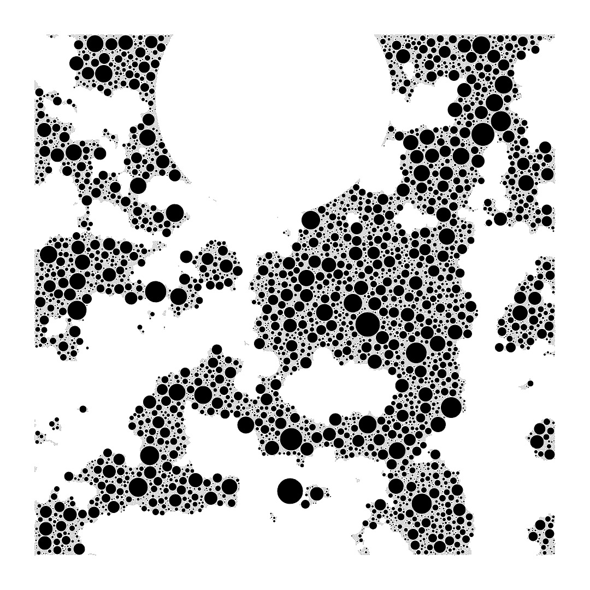
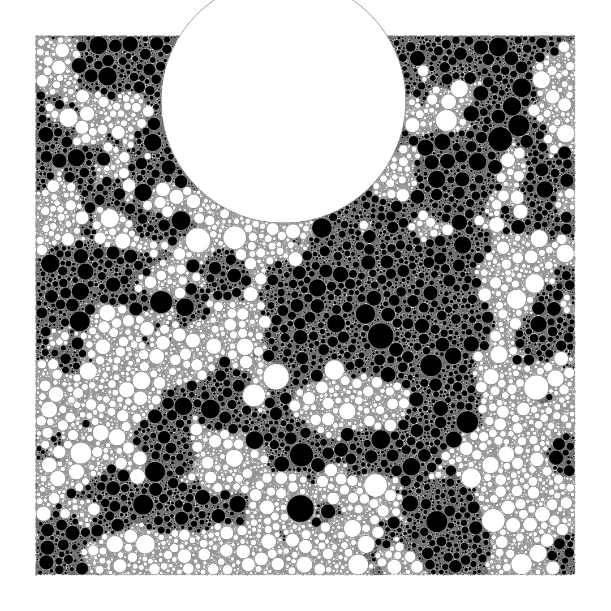

# Genuary 2022

JAN.12 (credit: Richard Vigniel) Packing (squares, circles, any shape…)

My prompts:

- hole
- negative space
- black and white

-----

### A subset the outputs
#### 00

#### 01

#### 02

#### 99

Showing all the circles "under the hood" that make up '02'.

