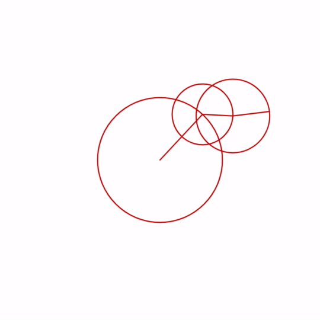

# Ribbonz




```json
{
  "name": "ribbonz n knots 6",
  "seed": 1645067622894,
  "width": 540,
  "height": 540,
  "fps": 30,
  "duration": 1020,
  "exportVideo": true,
  "isAnimated": true,
  "renderAsVector": false,
  "bgColour": "#fff",
  "strokeColour": "#fff",
  "ribbonColour": "#496082",
  "hideRibbon": false,
  "colours": [
    "#000000  ",
    "#fff"
  ],
  "scale": 1.3,
  "innerScale": 1.5,
  "minPoints": 2,
  "maxPoints": 9,
  "paintProbability": 0.75,
  "maxLength": 201,
  "startAngle": -45,
  "armSettings": [
    {
      "lengthFactor": 0.195,
      "speed": -2
    },
    {
      "lengthFactor": 0.095,
      "speed": 3
    },
    {
      "lengthFactor": 0.115,
      "speed": -7
    }
  ]
}
```


